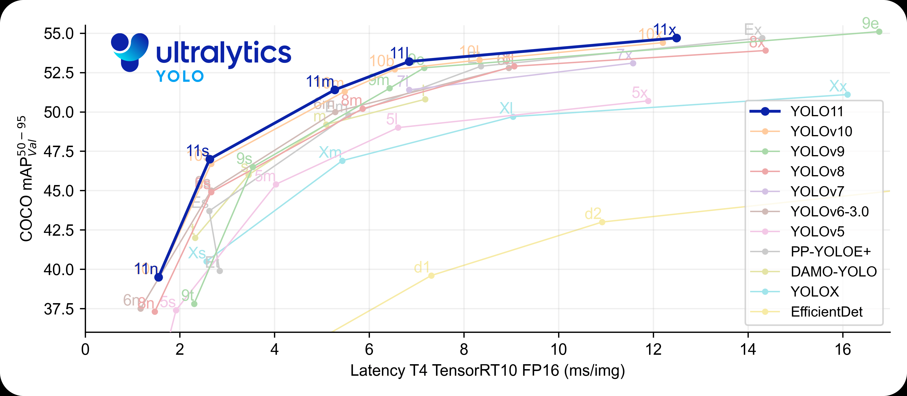
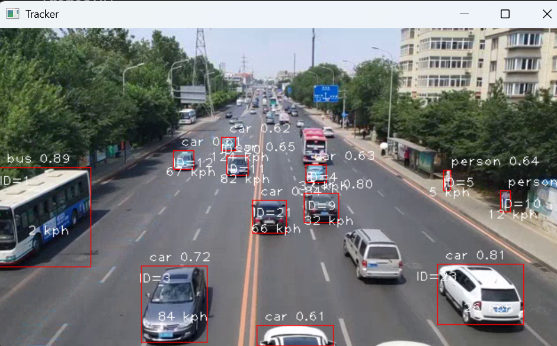
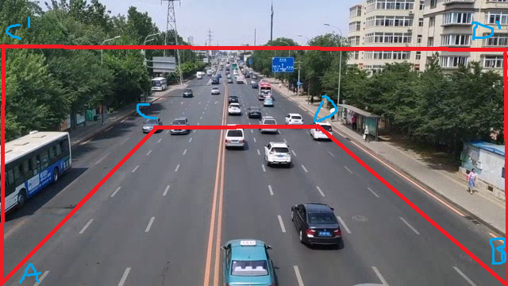

## 基于Yolov8目标分类Deepsort目标追踪

代码采用C++实现，目标检测支持YOLOv8,跟踪支持deepsort 。
检测模型可以直接从YOLOv8官网，导出onnx使用
特征提取可以自己训练，导出onnx使用，onnxruntime cpu 推理，方便使用.
特征支持自定义维度例如 128,256,512等

#### 操作系统：Ubuntu 18.04
#### YOLV ：https://github.com/ultralytics/yolov8
#### 硬件：NVIDIA GeForce RTX 4060 Ti 8G
#### CUDA 12.6
#### CUDNN 9.6
#### onnxruntime 1.12.1


#### 2 模型配置

yolov8n.onnx 

coco_80_labels_list.txt
coco.yaml

#### 3 主函数
选择打开视频文件或者视频流等

```c
cv::VideoCapture capture("./1.mp4");//打开本地视频文件
cv::VideoCapture capture(0);//打开摄像头
```

#### 操作系统：Windows11
#### 编译环境：Cmake  3.30.0-rc4
#### 编译工具：Visual Studio 2019
#### 硬件：INVIDIA Geforce RTC 3060
#### CUDA:12.6
#### Opencv:4.10.0
深度学习的模型分两块，一个是目标检测，另一个是目标跟踪
#### 目标检测的模型
地址：Yolov8 https://github.com/ultralytics/ultralytics

#### 目标跟踪模型
DeepSORT算法的主要步骤

目标检测：DeepSORT算法依赖于目标检测器来确定视频中每一帧的目标位置。常用的目标检测器包括YOLO、Faster R-CNN等。检测器的输出通常包括目标的边界框（bounding box）和类别。

特征提取：DeepSORT使用深度学习模型来提取目标的外观特征。这些特征对于目标的再识别（re-identification，简称Re-ID）至关重要，因为即使目标在视频中被临时遮挡或丢失，这些特征也能帮助算法重新识别和关联目标。

匹配和跟踪：DeepSORT算法中的匹配过程涉及到计算检测框和预测框之间的相似度，并使用匈牙利算法来找到最优匹配。这个过程还包括卡尔曼滤波器的使用，它根据目标的历史运动信息来预测其在下一帧中的位置。

卡尔曼滤波：用于预测目标在下一帧中的位置。

匈牙利算法：用于计算检测框和预测框之间的最优匹配。


### 物体距离速度计算
道路上的两条平行分界线上的四个点
//坐标转换
```C++
cv::Point2f src_points[] = {
           cv::Point2f(0,  359),//A
           cv::Point2f(639,  359),//B
           cv::Point2f(200,  160),//C
           cv::Point2f(400,  160) };//D
cv::Point2f dst_points[] = {
            cv::Point2f(0,  359),//A
            cv::Point2f(639,  359),//B
            cv::Point2f(0,  70),//C'
            cv::Point2f(639, 70) };//D'
Mat g_transform;
...
//计算放缩比例
g_transform = cv::getPerspectiveTransform(src_points, dst_points);
//根据比例，计算目标坐标用于计算距离和速度
cv::perspectiveTransform(points, transformed_points, g_transform);
```



